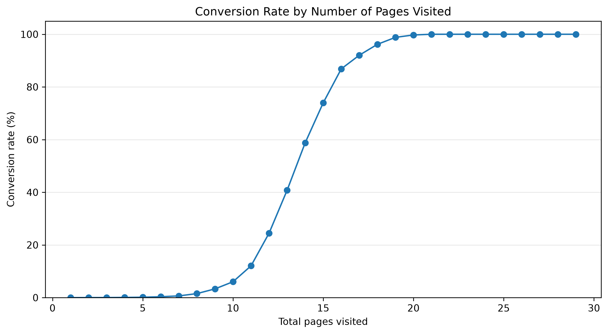
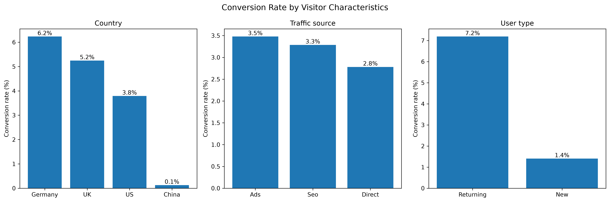
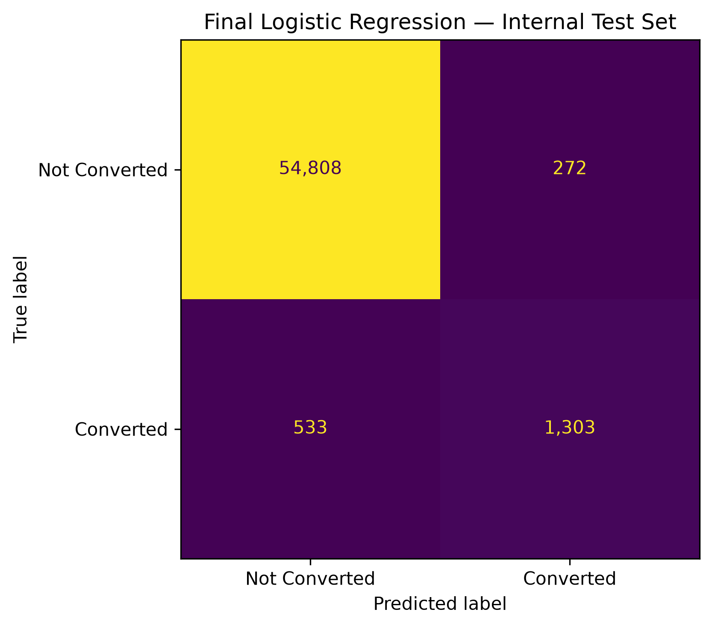

# Conversion Rate Challenge

## Overview

This project develops a supervised machine learning model to predict whether a website visitor will convert.

The objective is not only to maximize predictive performance, but also to build a reproducible workflow that supports business interpretation. Because conversions represent only a small fraction of observations, model evaluation focuses primarily on the **F1-score**, balancing precision and recall for the positive conversion class.

The final solution uses an interpretable **Logistic Regression** model with an optimized classification threshold. More complex nonlinear models were evaluated but did not provide a meaningful improvement.

## Dataset

The project uses two datasets:

- a labeled training dataset for model development and evaluation;
- a separate unlabeled competition test dataset used only for final predictions.

After removing two implausible age observations, the labeled dataset contains **284,578 observations**.

The five available predictors are:

| Feature | Description |
| --- | --- |
| `country` | Visitor country |
| `age` | Visitor age |
| `new_user` | Whether the visitor is a new user |
| `source` | Acquisition source |
| `total_pages_visited` | Number of pages visited during the session |

The target variable is `converted`.

Only approximately **3.2%** of the cleaned labeled observations converted, making this an imbalanced binary classification problem.

## Exploratory Analysis

Exploratory analysis identified several strong predictive patterns.

### Conversion and page engagement

Conversion probability rises sharply with the number of pages visited. Visitors who converted viewed substantially more pages on average than non-converters.



This is the strongest behavioral signal in the dataset. However, the relationship should not be interpreted causally: visitors with stronger purchase intent may naturally explore more pages.

### Visitor characteristics

Returning visitors convert considerably more frequently than new visitors. Conversion rates also vary by geography, with China exhibiting an exceptionally low observed conversion rate relative to the other represented countries.



These differences provide useful directions for investigation but do not establish that visitor characteristics themselves cause conversion outcomes.

## Modeling Approach

The labeled data was divided into stratified training and internal test sets. The internal test set remained untouched throughout model development and was used once for final evaluation.

Preprocessing was implemented inside scikit-learn pipelines:

- `StandardScaler` for numerical features;
- `OneHotEncoder(handle_unknown="ignore")` for categorical features;
- passthrough for the binary `new_user` feature.

Model development followed a deliberately focused progression:

1. Logistic Regression baseline
2. Logistic Regression hyperparameter tuning
3. Polynomial feature engineering
4. Random Forest
5. Histogram Gradient Boosting
6. Threshold optimization using out-of-fold predictions

Five-fold stratified cross-validation with **F1-score** was used for model comparison.

The nonlinear challengers did not produce a meaningful improvement over Logistic Regression. The simpler and more interpretable model was therefore retained.

## Final Model

The selected model is:

- **Algorithm:** Logistic Regression
- **Regularization:** `C = 10`
- **Class weighting:** None
- **Classification threshold:** `0.43`

The threshold was selected using out-of-fold predictions from the training data only. The internal test set was not used for threshold optimization.

### Performance

| Metric | Result |
| --- | ---: |
| Threshold-optimized OOF F1 | **0.7712** |
| Internal test F1 | **0.7640** |
| Internal test precision | **0.8273** |
| Internal test recall | **0.7097** |
| True positives | 1,303 |
| False positives | 272 |
| False negatives | 533 |
| True negatives | 54,808 |



The relatively small difference between out-of-fold and internal-test F1 suggests that the selected model generalizes consistently to unseen labeled observations.

## Model Interpretation

The final Logistic Regression coefficients highlight the variables most strongly associated with predicted conversion.


The strongest predictive associations include:

- higher `total_pages_visited`, associated with higher conversion probability;
- `new_user`, associated with lower conversion probability;
- China, associated with substantially lower predicted conversion;
- increasing age, associated with lower predicted conversion probability.

These coefficients describe **predictive associations rather than causal effects**.

## Business Insights

The analysis suggests several directions for further business investigation and experimentation.

**On-site engagement.** Page depth is the strongest behavioral predictor. Navigation, recommendations, and calls to action could be tested to determine whether helping visitors discover relevant content improves conversion.

**New-visitor experience.** New users convert substantially less frequently than returning users. The first-session experience should be examined for friction in onboarding, product discovery, trust signals, or calls to action.

**China-specific investigation.** The exceptionally low observed conversion rate among Chinese visitors warrants investigation into localization, payment methods, pricing, logistics, technical performance, and traffic quality before making market-level decisions.

**Acquisition channels.** Source contributes predictive information, but observed differences are smaller than the strongest engagement and visitor-level effects. Marketing allocation should therefore consider campaign cost, customer value, and incremental impact rather than conversion rate alone.

The model can also support visitor prioritization by predicted conversion propensity. Such scores estimate likelihood of conversion, not the causal impact of targeting a visitor, so operational interventions should be validated through controlled experiments.

## Competition Submission

After model selection and internal evaluation were complete, the fixed pipeline was retrained on all **284,578 cleaned labeled observations**.

It was then applied to the untouched **31,620-row competition test set** using the fixed `0.43` classification threshold.

The final submission contains:

- **885 predicted conversions**
- **30,735 predicted non-conversions**
- **2.80% predicted conversion rate**

The validated submission is stored in:

```text
outputs/submissions/conversion_predictions.csv
```

## Limitations

The dataset contains only five predictors and excludes potentially important information such as product interactions, device characteristics, session duration, campaign details, pricing, previous purchases, and customer value.

The observed relationships are predictive rather than causal. In particular, strong page engagement may reflect pre-existing purchase intent.

The dataset also cannot explain the unusually low conversion rate observed for China. Additional market-specific data would be required to identify the underlying causes.

Finally, the `0.43` threshold was selected to optimize F1-score. A production system with explicit business costs for false positives and false negatives could require a different operating threshold.

## Repository Structure

```text
3_Conversion_rate_challenge/
│
├── data/
│   └── raw/
│       ├── conversion_data_train.csv
│       └── conversion_data_test.csv
│
├── notebooks/
│   ├── 01_EDA_Preprocessing.ipynb
│   ├── 02_Modeling_Optimization.ipynb
│   └── 03_Final_Model_Submission_Insights.ipynb
│
├── outputs/
│   ├── figures/
│   ├── metrics/
│   │   └── final_model_metrics.csv
│   └── submissions/
│       └── conversion_predictions.csv
│
├── .gitignore
├── README.md
└── requirements.txt
```

Raw datasets are intentionally excluded from version control.

## Reproducibility

Create and activate a Python environment, then install the project dependencies:

```bash
pip install -r requirements.txt
```

Run the notebooks in numerical order:

```text
01_EDA_Preprocessing.ipynb
02_Modeling_Optimization.ipynb
03_Final_Model_Submission_Insights.ipynb
```

The notebooks use a fixed `random_state = 42` where applicable and reconstruct the preprocessing and modeling pipelines explicitly.

The final notebook recreates the competition submission, final metrics artifact, and model coefficient figure from the raw input datasets.